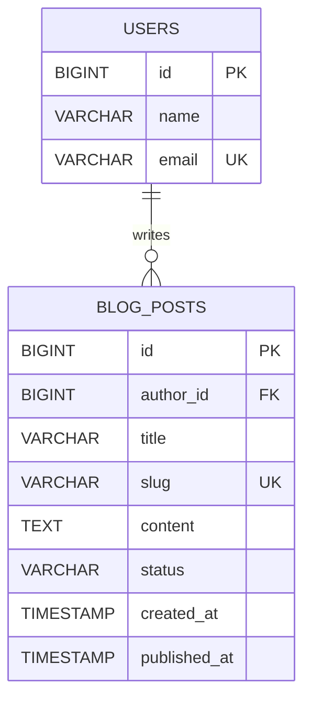

# ER-диаграмма блог-платформы

```mermaid
erDiagram
    USERS ||--o{ BLOG_POSTS : writes

    USERS {
        BIGINT id PK
        VARCHAR name
        VARCHAR email UK
    }

    BLOG_POSTS {
        BIGINT id PK
        BIGINT author_id FK
        VARCHAR title
        VARCHAR slug UK
        TEXT content
        VARCHAR status
        TIMESTAMP created_at
        TIMESTAMP published_at
    }
```

Один автор может иметь несколько публикаций. Каждая публикация обязательно связана ровно с одним автором через `blog_posts.author_id → users.id`.
